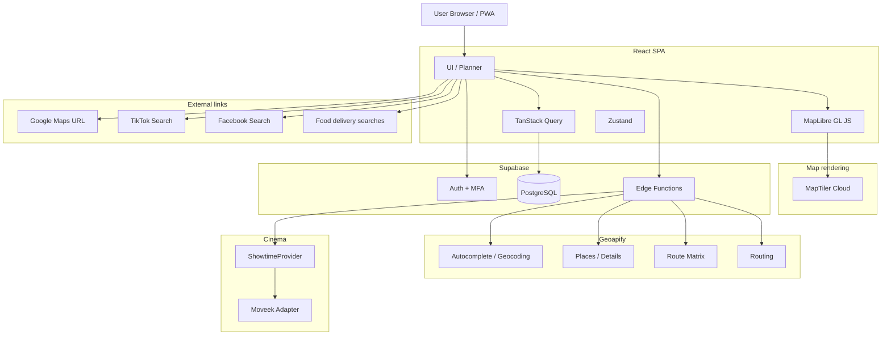

# 🗺️ SmartFoodRoute — Production Implementation Specification

> **Phiên bản**: 3.0  
> **Ngày cập nhật**: 2026-09-20  
> **Trạng thái**: Implementation-ready / AI-coder-ready  
> **Kiến trúc bản đồ mới**: MapLibre GL JS + MapTiler Cloud Free + Geoapify  
> **Backend/Auth**: Supabase  
> **Cinema/Showtime**: Moveek qua `ShowtimeProvider` an toàn + manual fallback  
> **Mục tiêu chi phí**: ưu tiên vận hành cá nhân / nhóm bạn với chi phí API bắt buộc ≈ 0 USD trong giới hạn free tier, không phụ thuộc Google Maps Platform billing.

---

# 0. QUY TẮC TỐI CAO CỦA SPEC

File này là **source of truth kỹ thuật chính thức** của SmartFoodRoute.

## 0.1. Bản v3.0 thay thế hoàn toàn các bản trước

Bản này **supersede toàn bộ `implementation.md` v1.x / v2.x / v2.1**.

Nếu repository hiện có code được tạo từ spec cũ, đặc biệt:

- Google Maps JavaScript API;
- `@googlemaps/js-api-loader`;
- `AdvancedMarkerElement`;
- Google Places;
- `PlaceAutocompleteElement`;
- Google Routes / `RouteMatrix`;
- `VITE_GOOGLE_MAPS_API_KEY`;
- `VITE_GOOGLE_MAP_ID`;

thì những phần đó được xem là **legacy implementation của project**, không còn là kiến trúc đích.

AI Agent phải:

1. giữ lại phần code vẫn đúng và độc lập với Google;
2. migrate Phase 3–4 sang kiến trúc v3;
3. không xóa bừa dữ liệu, migrations hoặc tests chưa đánh giá;
4. cập nhật `PROGRESS.md` theo trạng thái thực tế;
5. nếu Phase 3/4 từng ghi `DONE` theo spec cũ, phải reopen chúng thành `IN_PROGRESS` trong quá trình migration rồi chỉ đánh `DONE` lại sau khi v3 pass verification.

## 0.2. Kiến trúc geospatial chính thức

```text
Map rendering          → MapLibre GL JS
Basemap / vector tiles → MapTiler Cloud Free
Autocomplete           → Geoapify Address Autocomplete
POI / Places           → Geoapify Places API
Place details          → Geoapify Place Details API
Geocoding              → Geoapify Geocoding / Reverse Geocoding
Routing                → Geoapify Routing API
Route Matrix           → Geoapify Route Matrix API

Google Maps Platform API → KHÔNG dùng làm dependency runtime
Google Maps URL          → CHỈ external shortcut, không cần API key
```

## 0.3. Google Maps vẫn được dùng ở mức external handoff

Google Maps vẫn được phép dùng dưới dạng **universal URL bên ngoài ứng dụng**:

- mở Google Maps để đọc rating/review/photo;
- mở tìm kiếm một quán;
- tùy chọn mở directions bên ngoài;
- user có thể lưu `google_maps_url` thủ công cho một địa điểm để mở đúng listing.

Không:

- gọi Places API của Google;
- gọi Maps JavaScript API của Google;
- scrape Google Maps;
- crawl review/rating/photo;
- parse HTML Google Maps;
- bypass anti-bot;
- persist Google review content.

## 0.4. Mục tiêu free-tier

Kiến trúc phải tối ưu cho use case:

- cá nhân;
- bạn bè;
- non-commercial / hobby;
- lượng request thấp;
- không yêu cầu billing Google Maps Platform.

Free-tier là **giới hạn sử dụng**, không phải guarantee tồn tại vĩnh viễn. Provider có thể đổi pricing/quota. Vì vậy:

- mọi provider phải nằm sau service/adapter;
- quota phải được monitor;
- không hard-code assumption rằng quota sẽ mãi giữ nguyên;
- nếu provider hết quota, app degrade gracefully thay vì crash.

## 0.5. Quy tắc bảo mật

1. Không đưa Supabase `service_role` / secret key vào frontend.
2. Không đưa `SUPABASE_ACCESS_TOKEN` vào frontend.
3. `GEOAPIFY_API_KEY` ưu tiên giữ server-side trong Supabase Edge Function.
4. `VITE_MAPTILER_API_KEY` là browser key và phải được khóa bằng Allowed HTTP Origins.
5. Không commit `.env.local`, secret hoặc database password.
6. Mọi user-owned table phải bật RLS.
7. Dữ liệu yêu cầu MFA phải enforce `aal2` ở database, không chỉ frontend.
8. Public share không được mở SELECT toàn bộ `saved_tours`.
9. Private place không được leak exact address/coordinates qua public share.
10. Showtimes không được xem là static; phải có freshness/revalidation.

## 0.6. Quy tắc implementation

- Node 24 LTS.
- React + TypeScript strict.
- Không dùng `any` để né type errors nếu không có lý do rõ ràng.
- Không disable lint/test để build pass.
- Schema thay đổi qua migrations.
- Không sửa `implementation.md` để hợp thức hóa bug trong code.
- Correctness/security trước animation.
- Mọi phase phải có verification gate.
- `PROGRESS.md` phải được cập nhật liên tục.

---

# 1. MỤC TIÊU SẢN PHẨM

SmartFoodRoute là web app mobile-first để giải quyết bài toán:

> “Tối nay đi đâu, ăn gì, xem phim suất nào, chụp photobooth lúc nào, nên xuất phát mấy giờ và đi theo thứ tự nào để không trễ?”

## 1.1. Core problems

- Không biết ăn gì.
- Có nhiều quán nhưng không biết quán nào thuận đường.
- Muốn ghép ăn → chơi/photobooth → phim → cafe.
- Giờ phim là cố định.
- Không biết phải xuất phát lúc nào để kịp suất phim.
- Quán có thể đóng cửa trước khi tới.
- Không muốn chạy vòng ngược hướng.
- Muốn route cho xe máy / ô tô / đi bộ.
- Muốn xem review Google/TikTok/Facebook nhưng không muốn trả phí Google Places API.
- Muốn chia sẻ lịch trình nhưng không lộ địa chỉ nhà.

## 1.2. Core journey

```text
Sign up / Login
→ Email verification
→ MFA TOTP
→ AAL2
→ Dashboard MapLibre
→ Search Geoapify / lưu custom place
→ Chọn điểm xuất phát
→ Chọn food / cafe / entertainment / photobooth / cinema
→ Nếu có cinema:
     chọn rạp
     → lấy movie/showtime từ ShowtimeProvider
     → chọn phim
     → chọn suất chiếu
     → showtime = FIXED-TIME ANCHOR
→ Chọn phương tiện
→ Planner tính các candidate
→ pre-filter local
→ Geoapify Route Matrix
→ backward schedule trước phim
→ forward schedule sau phim
→ validate opening hours / buffers
→ rank feasible routes
→ Top 3
→ Timeline + Map + Budget
→ "Xem review Google Maps" nếu muốn
→ "Đặt vé Moveek" nếu muốn
→ Lưu tour
→ Share / QR
```

---

# 2. PHẠM VI VÀ NON-GOALS

## 2.1. MVP bắt buộc

- Email/password auth.
- Email confirmation.
- MFA TOTP.
- AAL2 RLS.
- MapLibre map.
- MapTiler basemap.
- Geoapify autocomplete.
- Geoapify Places.
- Saved places.
- Custom/private places.
- Food/cafe/cinema/entertainment/photobooth categories.
- Cinema showtime provider.
- Fixed-time scheduling.
- Geoapify route matrix.
- Geoapify final route.
- Opening-hours checks khi dữ liệu có sẵn.
- Timeline.
- Budget estimator.
- External Google Maps review shortcut.
- External Moveek booking handoff.
- Secure tour sharing.
- Responsive mobile UI.
- Unit/integration/security/E2E tests.

## 2.2. Phase 2 product polish

- Lucky Wheel.
- PWA.
- Confetti/sound.
- Advanced route animation.
- Offline shell.
- richer social radar.
- advanced ranking/preferences.

## 2.3. Non-goals

App không:

- tự mua vé phim;
- giữ ghế;
- xử lý payment;
- scrape Google Maps;
- scrape TikTok/Facebook;
- bypass Moveek anti-bot;
- cung cấp navigation turn-by-turn riêng;
- hứa routing/live traffic chính xác như Google Maps;
- public exact home coordinates mặc định.

---

# 3. KIẾN TRÚC TỔNG THỂ



## 3.1. Vì sao dùng proxy Geoapify qua Edge Function

Geoapify browser key có thể được giới hạn origin, nhưng project này ưu tiên:

```text
Browser
→ Supabase Edge Function
→ Geoapify
```

để:

- key không nằm trong frontend bundle;
- centralize validation;
- rate limiting;
- response normalization;
- caching ngắn hạn;
- quota tracking;
- provider có thể đổi sau này mà frontend ít thay đổi.

Exception:

- MapTiler key cần client-side để render tiles.
- MapTiler key phải restrict HTTP Origins.

---

# 4. TECH STACK CHUẨN

| Layer | Technology | Ghi chú |
|---|---|---|
| Runtime | Node.js 24 LTS | dev/CI |
| Frontend | React + TypeScript + Vite | SPA |
| CSS | Tailwind CSS v4 | Vite plugin |
| UI icons | Lucide React | |
| Animation | Framer Motion | polish |
| Async state | TanStack Query | API/server state |
| Local state | Zustand | planner/map |
| Validation | Zod | env/forms/API |
| Map renderer | MapLibre GL JS | OSS |
| Basemap | MapTiler Cloud | Free hobby/non-commercial |
| Places/Geocode | Geoapify | via Edge Function |
| Routing/Matrix | Geoapify | via Edge Function |
| Backend | Supabase | Auth/DB/Edge |
| Database | PostgreSQL | RLS |
| MFA | Supabase TOTP | AAL2 |
| Cinema | `ShowtimeProvider` | Moveek adapter/fallback |
| QR | qrcode.react | |
| Unit tests | Vitest | |
| Component tests | Testing Library | |
| E2E | Playwright | |
| CI | GitHub Actions | |
| Hosting | Vercel preferred | GitHub Pages optional |

## 4.1. Không cài

Không cần:

```text
@react-google-maps/api
@googlemaps/js-api-loader
google.maps.*
```

## 4.2. Dependencies dự kiến

```bash
npm install \
  @supabase/supabase-js \
  @tanstack/react-query \
  zustand \
  zod \
  maplibre-gl \
  lucide-react \
  framer-motion \
  canvas-confetti \
  qrcode.react \
  date-fns

npm install -D \
  tailwindcss \
  @tailwindcss/vite \
  eslint \
  typescript \
  vitest \
  @testing-library/react \
  @testing-library/jest-dom \
  @playwright/test \
  @types/canvas-confetti
```

Không bắt buộc đúng tuyệt đối versions trong spec. AI phải dùng stable versions tương thích tại thời điểm triển khai.

---

# 5. CẤU TRÚC PROJECT

```text
SmartFoodRoute/
├── .github/
│   └── workflows/
│       └── ci.yml
│
├── public/
│   ├── icons/
│   └── manifest.webmanifest
│
├── supabase/
│   ├── config.toml
│   ├── migrations/
│   ├── tests/
│   └── functions/
│       ├── geo/
│       │   └── index.ts
│       ├── showtimes/
│       │   └── index.ts
│       └── shared-tour/
│           └── index.ts
│
├── src/
│   ├── app/
│   │   ├── router.tsx
│   │   └── providers.tsx
│   │
│   ├── components/
│   │   ├── auth/
│   │   ├── map/
│   │   │   ├── MapView.tsx
│   │   │   ├── PlaceMarker.tsx
│   │   │   ├── RouteLayer.tsx
│   │   │   ├── MapControls.tsx
│   │   │   └── PlacePopup.tsx
│   │   ├── places/
│   │   │   ├── PlaceSearch.tsx
│   │   │   ├── PlaceDetailsSheet.tsx
│   │   │   ├── SavePlaceModal.tsx
│   │   │   └── GoogleReviewShortcut.tsx
│   │   ├── planner/
│   │   ├── cinema/
│   │   ├── timeline/
│   │   ├── budget/
│   │   ├── wheel/
│   │   ├── share/
│   │   └── ui/
│   │
│   ├── hooks/
│   │   ├── useAuth.ts
│   │   ├── useMfa.ts
│   │   ├── usePlaces.ts
│   │   ├── useMap.ts
│   │   ├── useRoutePlanner.ts
│   │   └── useShowtimes.ts
│   │
│   ├── lib/
│   │   ├── supabase.ts
│   │   ├── queryClient.ts
│   │   ├── env.ts
│   │   └── maplibre.ts
│   │
│   ├── services/
│   │   ├── geo/
│   │   │   ├── geoClient.ts
│   │   │   ├── geoTypes.ts
│   │   │   └── normalizers.ts
│   │   ├── routing/
│   │   │   ├── routeMatrixService.ts
│   │   │   ├── routeService.ts
│   │   │   └── routeTypes.ts
│   │   ├── showtimes/
│   │   ├── externalLinks/
│   │   │   ├── googleMapsUrl.ts
│   │   │   ├── socialSearchUrls.ts
│   │   │   └── moveekUrl.ts
│   │   └── places/
│   │       └── placeRepository.ts
│   │
│   ├── stores/
│   │   ├── plannerStore.ts
│   │   └── mapStore.ts
│   │
│   ├── utils/
│   │   ├── distance.ts
│   │   ├── time.ts
│   │   ├── schedule.ts
│   │   ├── privacy.ts
│   │   └── money.ts
│   │
│   ├── types/
│   ├── pages/
│   ├── main.tsx
│   └── index.css
│
├── .env.example
├── .gitignore
├── PROGRESS.md
├── implementation.md
├── package.json
├── tsconfig.json
├── vite.config.ts
└── README.md
```

---

# 6. ENVIRONMENT VARIABLES

## 6.1. Frontend/browser variables

```env
VITE_SUPABASE_URL=
VITE_SUPABASE_PUBLISHABLE_KEY=

# Browser-visible, restrict bằng MapTiler Allowed HTTP Origins
VITE_MAPTILER_API_KEY=

VITE_APP_URL=http://localhost:5173
```

## 6.2. Supabase Edge Function secrets

```env
GEOAPIFY_API_KEY=
```

Potential future:

```env
SHOWTIME_PROVIDER_API_KEY=
```

nếu provider chính thức yêu cầu.

## 6.3. CLI/deployment secret

Không đưa vào Vite:

```env
SUPABASE_ACCESS_TOKEN=
SUPABASE_PROJECT_REF=
DATABASE_PASSWORD=
```

## 6.4. Không được tồn tại

```env
VITE_SUPABASE_SERVICE_ROLE_KEY=
VITE_SUPABASE_SECRET_KEY=
VITE_SUPABASE_ACCESS_TOKEN=
VITE_DATABASE_PASSWORD=
VITE_GEOAPIFY_ADMIN_SECRET=
```

## 6.5. Zod env validation

Frontend chỉ validate public variables.

Edge Functions validate secret của riêng chúng.

App phải có UX rõ ràng nếu:

- thiếu MapTiler key;
- Supabase env sai;
- Geo service unavailable.

---

# 7. SUPABASE AUTH + MFA

## 7.1. First factor

Default:

```text
Email + password
```

TOTP không phải first factor.

## 7.2. Signup

```text
User enters email/password
→ supabase.auth.signUp()
→ email confirmation
→ login
→ session AAL1
→ enroll MFA nếu chưa enroll
→ verify TOTP
→ AAL2
→ app
```

## 7.3. MFA enrollment

```ts
const { data, error } = await supabase.auth.mfa.enroll({
  factorType: 'totp',
  friendlyName: 'SmartFoodRoute Authenticator',
});
```

UI:

- render provider QR/URI;
- user scan Google Authenticator-compatible app;
- user nhập 6 số;
- challenge + verify;
- session phải đạt AAL2.

## 7.4. Login flow

```text
signInWithPassword
→ getAuthenticatorAssuranceLevel
→ nếu nextLevel == aal2
      listFactors
      challengeAndVerify TOTP
→ refresh/check AAL
→ dashboard
```

## 7.5. Guards

```text
AuthGuard
MfaGuard
```

Guards chỉ là UX.

Security thật nằm ở RLS.

## 7.6. Recovery / reset

Support:

- forgot password;
- reset password;
- session expiry;
- sign out;
- invalid OTP;
- expired challenge;
- factor re-enroll;
- clear local query cache on logout.

---

# 8. DATABASE MODEL

## 8.1. Extensions

```sql
create extension if not exists pgcrypto;
```

Dùng `gen_random_uuid()`.

## 8.2. Enums

```sql
create type public.place_source as enum (
  'geoapify',
  'custom'
);

create type public.place_category as enum (
  'food',
  'cafe',
  'cinema',
  'entertainment',
  'start_point',
  'other'
);

create type public.transport_mode as enum (
  'MOTORCYCLE',
  'SCOOTER',
  'DRIVING',
  'WALKING'
);

create type public.stop_timing_type as enum (
  'FLEXIBLE',
  'FIXED'
);
```

## 8.3. profiles

```sql
create table public.profiles (
  id uuid primary key references auth.users(id) on delete cascade,
  email text not null,
  full_name text,
  avatar_url text,
  created_at timestamptz not null default now(),
  updated_at timestamptz not null default now()
);
```

## 8.4. saved_places

```sql
create table public.saved_places (
  id uuid primary key default gen_random_uuid(),
  user_id uuid not null references auth.users(id) on delete cascade,

  source public.place_source not null default 'custom',

  -- Geoapify provider identity when available
  provider_place_id text,

  name text not null,
  address text,

  lat double precision not null,
  lng double precision not null,

  category public.place_category not null,
  sub_category text,

  -- user-owned metadata
  notes text,
  custom_tags text[] not null default '{}',
  is_favorite boolean not null default false,
  is_private boolean not null default false,

  estimated_cost_per_person integer,
  average_time_spent_minutes integer,

  -- optional manually-saved external listing
  google_maps_url text,

  -- app may snapshot source/provider label for attribution/debugging
  source_name text,

  created_at timestamptz not null default now(),
  updated_at timestamptz not null default now(),

  constraint provider_shape check (
    source <> 'geoapify' or provider_place_id is not null
  ),

  constraint valid_coordinates check (
    lat between -90 and 90
    and lng between -180 and 180
  ),

  constraint nonnegative_cost check (
    estimated_cost_per_person is null
    or estimated_cost_per_person >= 0
  )
);
```

## 8.5. Unique provider place per user

```sql
create unique index saved_places_user_provider_unique
on public.saved_places(user_id, provider_place_id)
where provider_place_id is not null;
```

## 8.6. cinema_provider_links

Dùng để map cinema user chọn với provider showtime.

```sql
create table public.cinema_provider_links (
  id uuid primary key default gen_random_uuid(),
  user_id uuid not null references auth.users(id) on delete cascade,
  saved_place_id uuid not null references public.saved_places(id) on delete cascade,

  provider text not null,
  provider_cinema_id text not null,
  provider_cinema_name text,
  provider_cinema_url text,

  confidence numeric(4,3),
  verified_by_user boolean not null default false,

  created_at timestamptz not null default now(),
  updated_at timestamptz not null default now(),

  unique(user_id, saved_place_id, provider)
);
```

## 8.7. saved_tours

```sql
create table public.saved_tours (
  id uuid primary key default gen_random_uuid(),
  user_id uuid not null references auth.users(id) on delete cascade,

  title text not null,

  departure_at timestamptz,
  party_size integer not null default 2,
  transport_mode public.transport_mode not null default 'MOTORCYCLE',

  optimization_objective text not null default 'TRAVEL_DURATION',

  total_distance_meters integer,
  total_duration_minutes integer,
  total_estimated_budget integer,

  is_shared boolean not null default false,
  share_token uuid,
  share_expires_at timestamptz,

  created_at timestamptz not null default now(),
  updated_at timestamptz not null default now(),

  constraint valid_party_size check (party_size between 1 and 20),
  constraint unique_share_token unique(share_token)
);
```

## 8.8. tour_stops

Store normalized snapshot đủ để historical tour vẫn đọc được.

```sql
create table public.tour_stops (
  id uuid primary key default gen_random_uuid(),
  tour_id uuid not null references public.saved_tours(id) on delete cascade,

  position integer not null,
  saved_place_id uuid references public.saved_places(id) on delete set null,

  name_snapshot text not null,

  -- public/private handling:
  lat_snapshot double precision,
  lng_snapshot double precision,
  address_snapshot text,

  category public.place_category not null,
  sub_category text,

  timing_type public.stop_timing_type not null default 'FLEXIBLE',
  planned_arrival_at timestamptz,
  planned_departure_at timestamptz,

  fixed_start_at timestamptz,
  fixed_end_at timestamptz,

  duration_minutes integer,
  estimated_cost integer,

  -- cinema/showtime
  showtime_provider text,
  provider_cinema_id text,
  provider_movie_id text,
  provider_showtime_id text,
  movie_title text,
  movie_runtime_minutes integer,
  showtime_fetched_at timestamptz,
  booking_url text,

  created_at timestamptz not null default now(),

  unique(tour_id, position)
);
```

## 8.9. Private snapshot rule

Nếu source place `is_private = true`:

- owner view có thể dùng full coordinates;
- public share response phải redact;
- database có thể giữ exact snapshot nếu cần cho owner;
- public RPC tuyệt đối không return exact coordinates/address mặc định.

---

# 9. RLS & AUTHORIZATION

Bật RLS:

```sql
alter table public.profiles enable row level security;
alter table public.saved_places enable row level security;
alter table public.cinema_provider_links enable row level security;
alter table public.saved_tours enable row level security;
alter table public.tour_stops enable row level security;
```

## 9.1. Ownership policy pattern

```sql
auth.uid() = user_id
```

Phải có cả:

- `USING`
- `WITH CHECK`

khi phù hợp.

## 9.2. AAL2 restrictive policy

Các bảng personal data phải yêu cầu AAL2 theo spec.

Concept:

```sql
(select auth.jwt()->>'aal') = 'aal2'
```

Tạo restrictive policy hoặc equivalent để:

- authenticated AAL1 không đọc được protected user data;
- AAL2 mới truy cập được.

## 9.3. tour_stops policy

Owner của parent tour mới được access.

Không chỉ dựa trên arbitrary tour_id.

Use `exists(...)` check parent ownership.

## 9.4. SQL security tests

Bắt buộc test:

- AAL1 denied.
- AAL2 allowed owner.
- User A cannot read B.
- User A cannot update B.
- User A cannot delete B.
- User A cannot spoof `user_id`.
- tour_stop foreign parent ownership.
- share flow không bypass RLS.
- private place deletion không làm public snapshot leak.

---

# 10. SECURE PUBLIC SHARING

Không tạo policy:

```sql
using (share_token is not null)
```

cho anonymous SELECT trực tiếp.

## 10.1. Public share contract

Public client gọi:

```text
get_shared_tour(token)
```

RPC/Edge Function:

1. validate token format;
2. select đúng 1 tour;
3. check `is_shared`;
4. check expiration;
5. select stops;
6. redact private information;
7. return safe DTO.

## 10.2. Safe DTO

```ts
interface PublicSharedTour {
  id: string;
  title: string;
  departureAt: string | null;
  transportMode: TransportMode;
  totalDurationMinutes: number | null;
  totalBudget: number | null;
  stops: PublicSharedStop[];
}
```

Private stop:

```ts
{
  name: "Điểm bắt đầu riêng tư",
  category: "start_point",
  lat: null,
  lng: null,
  address: null
}
```

Không return hidden internal metadata.

---

# 11. MAPLIBRE + MAPTILER INTEGRATION

## 11.1. MapLibre

MapLibre chịu trách nhiệm:

- map renderer;
- camera;
- markers;
- popups;
- route GeoJSON layers;
- controls;
- map events.

Initialize:

```ts
import { Map, NavigationControl, GeolocateControl } from 'maplibre-gl';
import 'maplibre-gl/dist/maplibre-gl.css';

const map = new Map({
  container: containerElement,
  style: mapStyleUrl,
  center: [106.7, 10.78],
  zoom: 12,
});
```

## 11.2. MapTiler style

Preferred style URL:

```text
https://api.maptiler.com/maps/streets-v4/style.json?key=...
```

Style cụ thể có thể đổi.

Không hardcode style assumption ở nhiều nơi.

Create helper:

```ts
getMapStyleUrl(theme)
```

## 11.3. MapTiler API key

`VITE_MAPTILER_API_KEY` là client-visible.

Security:

- create dedicated web key;
- Allowed HTTP Origins:
  - `http://localhost:5173`
  - production domain;
- không reuse admin/service token;
- rotate nếu nghi misuse.

## 11.4. Attribution

Map attribution luôn visible theo yêu cầu provider/data source.

Không che/hide attribution bằng CSS.

## 11.5. Custom markers

Dùng `maplibregl.Marker` với custom HTML element.

Categories:

```text
food          🍜
cafe          ☕
cinema        🎬
entertainment 🎡
photobooth    📸
start_point   🏠
other         📍
```

Requirements:

- accessible button semantics;
- minimum hit target;
- selected state;
- keyboard interaction;
- no duplicate marker instances on rerender.

## 11.6. Map lifecycle

React component phải:

- initialize once;
- cleanup `map.remove()`;
- cleanup markers;
- remove event listeners;
- not recreate map on every query state change.

## 11.7. Route layer

Geoapify route trả geometry/GeoJSON.

Render bằng:

```text
GeoJSON source
→ line layer
```

Không dùng DOM marker cho polyline.

Use:

- line cap round;
- line join round;
- visible selected route;
- alternate routes subdued.

Animated line là polish, không phải requirement core.

## 11.8. Geolocation

Chỉ request geolocation sau user action hoặc khi UX rõ ràng.

Handle:

- granted;
- denied;
- unavailable;
- timeout.

Không bắt user share location để app hoạt động.

---

# 12. GEOAPIFY PROVIDER LAYER

## 12.1. Provider abstraction

Frontend không gọi raw Geoapify URL rải rác.

```ts
interface GeoProvider {
  autocomplete(input: AutocompleteInput): Promise<GeoSuggestion[]>;
  searchPlaces(input: PlaceSearchInput): Promise<GeoPlace[]>;
  placeDetails(input: PlaceDetailsInput): Promise<GeoPlaceDetails>;
  reverseGeocode(input: LatLng): Promise<GeoAddress | null>;
  routeMatrix(input: RouteMatrixInput): Promise<RouteMatrixResult>;
  route(input: RouteInput): Promise<RouteResult>;
}
```

Frontend implementation:

```text
SupabaseGeoClient
```

Server implementation:

```text
GeoapifyProvider
```

## 12.2. Edge Function routes

One function can expose action-based endpoint:

```text
POST /functions/v1/geo
```

Body:

```json
{
  "action": "autocomplete",
  "payload": {}
}
```

Allowed actions:

```text
autocomplete
places
placeDetails
reverseGeocode
routeMatrix
route
```

Use Zod/schema validation.

Reject unknown fields where practical.

## 12.3. Authentication

By default:

- Geo endpoints require authenticated AAL2 user.
- Shared public tour không được gọi arbitrary Geoapify proxy.

This prevents public quota abuse.

## 12.4. Rate limiting

App-level soft limit per user/session.

Examples:

- autocomplete debounce 250–400ms;
- minimum input 3 chars;
- abort previous search;
- avoid duplicate requests;
- planner matrix only when candidates stable.

## 12.5. Normalization

Raw Geoapify data phải normalize vào own domain model.

```ts
interface GeoPlace {
  provider: 'geoapify';
  providerPlaceId: string;
  name: string;
  address: string | null;
  lat: number;
  lng: number;
  categories: string[];
  rawCategory?: string;
  website?: string | null;
  phone?: string | null;
  openingHoursText?: string | null;
  sourceAttribution: string[];
}
```

Không để components phụ thuộc raw response schema.

---

# 13. SEARCH / AUTOCOMPLETE / PLACES

## 13.1. Autocomplete

Geoapify Address Autocomplete:

- debounce;
- proximity bias tới map center/current area;
- Vietnam language preference nếu phù hợp;
- limit result count;
- keyboard selection;
- loading spinner;
- clear button;
- zero result.

## 13.2. Search restaurant/cafe/etc.

Autocomplete tìm **tên/địa chỉ**.

Places API dùng khi:

- browse POI nearby;
- category search;
- Lucky Wheel candidate;
- discover nearby food/cafe/cinema.

## 13.3. Categories mapping

Own domain mapping example:

```ts
const GEOAPIFY_CATEGORY_MAP = {
  food: [
    'catering.restaurant',
    'catering.fast_food',
    'catering.food_court',
  ],
  cafe: [
    'catering.cafe',
  ],
  cinema: [
    'entertainment.cinema',
  ],
  entertainment: [
    'entertainment',
    'leisure',
  ],
} as const;
```

Production phải inspect actual provider categories và test.

## 13.4. Place Details

Geoapify Place Details có thể thiếu field nếu OSM không có.

Không assume:

- phone luôn có;
- website luôn có;
- opening hours luôn có;
- category luôn hoàn hảo.

UI phải support missing data.

## 13.5. Data source

Geoapify Places/Details chủ yếu dựa trên OpenStreetMap, và Place Details có thể kết hợp Wikidata.

UI phải có attribution phù hợp.

## 13.6. Save place

Khi user save Geoapify place:

persist:

- provider_place_id;
- name;
- address;
- coordinates;
- normalized category;
- user notes;
- cost estimate;
- duration;
- privacy;
- optional google_maps_url.

Không lưu raw provider response JSON lớn trừ khi có lý do.

## 13.7. Custom place

User có thể:

- click map;
- long press mobile;
- enter coordinates;
- type custom label.

Custom place không cần provider ID.

Examples:

```text
Nhà tôi
Nhà cô ấy
Điểm đón
Photobooth tự lưu
```

Default `start_point` hoặc home-like label → private.

---

# 14. GOOGLE MAPS REVIEW SHORTCUT — KHÔNG DÙNG GOOGLE API

## 14.1. Mục tiêu

Geoapify không có review/rating richness như Google Maps.

Thay vì gọi Google Places API, app cung cấp:

```text
[Xem đánh giá trên Google Maps]
```

## 14.2. Google Maps URL

Google Maps URLs không yêu cầu Google API key.

Builder:

```ts
function buildGoogleMapsSearchUrl(place: {
  name: string;
  address?: string | null;
  lat?: number;
  lng?: number;
  googleMapsUrl?: string | null;
}) {
  if (place.googleMapsUrl) return place.googleMapsUrl;

  const query = [place.name, place.address].filter(Boolean).join(', ');

  const url = new URL('https://www.google.com/maps/search/');
  url.searchParams.set('api', '1');
  url.searchParams.set(
    'query',
    query || `${place.lat},${place.lng}`,
  );

  return url.toString();
}
```

## 14.3. Optional exact listing URL

Trong Place Details:

```text
Google Maps link (optional)
```

User có thể paste link bằng:

```text
Google Maps
→ Share
→ Copy link
→ paste vào SmartFoodRoute
```

App validate:

- HTTPS;
- host hợp lệ;
- URL length;
- không execute JS URL.

## 14.4. Không scrape

Button chỉ mở external app/browser.

Không:

- fetch review HTML;
- show copied review content;
- scrape rating;
- store review counts;
- proxy Google web page.

## 14.5. Social Radar cùng place

```text
Google Maps Reviews
TikTok Review
Facebook Search
GrabFood Search
ShopeeFood Search
```

External search convenience, không phải data ingestion.

---

# 15. ROUTING PROVIDER — GEOAPIFY

## 15.1. Transport mapping

App → Geoapify:

```ts
const MODE_MAP = {
  MOTORCYCLE: 'motorcycle',
  SCOOTER: 'scooter',
  DRIVING: 'drive',
  WALKING: 'walk',
} as const;
```

## 15.2. Route Matrix

Dùng Geoapify Route Matrix để lấy:

- travel duration;
- travel distance;
- source-target costs.

Không gọi matrix cho tất cả saved places.

Pipeline:

```text
candidate places
→ hard filters
→ cheap Haversine/local filter
→ Top N per activity
→ route matrix
→ combinations
→ schedule feasibility
→ rank
```

## 15.3. Matrix size control

Default:

```text
Top 5 food
Top 5 cafe
Top 5 entertainment
Top 5 cinema
```

Nhưng phase logic có thể giảm thêm.

Không tạo matrix khổng lồ vì app chỉ cần route candidates.

## 15.4. Traffic model

Nếu provider hỗ trợ:

```text
free_flow
approximated
```

App có thể dùng `approximated` cho motorized mode khi phù hợp.

Không mô tả là “live traffic chính xác”.

Label:

```text
Ước tính giao thông
```

## 15.5. Final route

Sau khi chọn candidate route:

```text
Geoapify Routing API
→ geometry
→ instructions nếu cần
→ distance
→ duration
→ map GeoJSON
```

Planner không nên lấy final geometry cho tất cả combo.

Matrix trước, final route sau.

## 15.6. Failure

Nếu matrix fail:

- retry bounded;
- show warning;
- fallback Haversine estimate chỉ để preview;
- route không được đánh “verified” nếu chưa có provider route.

---

# 16. ROUTE OPTIMIZER

## 16.1. Core problem

Ví dụ:

```text
Start S
Food: F1 F2 F3
Photobooth: P1 P2
Cinema: C
Cafe: K1 K2
```

Cinema showtime 20:00.

Không đơn giản minimize distance.

Phải tìm **feasible schedule**.

## 16.2. Hard constraints

Route bị loại nếu:

- stop đã đóng khi tới;
- fixed showtime bị trễ;
- thiếu arrival buffer;
- duration vượt user availability;
- activity order bắt buộc bị vi phạm;
- travel leg không có route khả thi;
- user budget hard limit bị vượt nếu user bật hard limit.

## 16.3. Objective

Primary:

```text
minimize total travel duration
```

Tie-breakers:

1. distance;
2. waiting time;
3. soft preference score;
4. budget delta.

## 16.4. One-way requirement

Default:

```text
không cộng đường quay lại start
```

Trừ khi user explicitly thêm “về nhà” làm final stop.

## 16.5. Candidate generation

Không brute force vô hạn.

Use:

```text
filter
→ rank preliminary
→ top N
→ product combinations
```

## 16.6. Route score

Example:

```ts
score =
  travelMinutes * 1.0 +
  waitingMinutes * 0.25 +
  distanceKm * 0.05 +
  preferencePenalty +
  budgetPenalty;
```

Hard constraints không dùng penalty — fail là loại.

Weights phải centralized config.

---

# 17. OPENING HOURS

## 17.1. Reality

OSM/Geoapify opening-hours coverage không đầy đủ bằng Google.

Logic phải distinguish:

```text
OPEN
CLOSED
CLOSING_SOON
UNKNOWN
```

## 17.2. UNKNOWN không đồng nghĩa CLOSED

Nếu thiếu data:

UI:

```text
"Chưa có dữ liệu giờ mở cửa — nên kiểm tra trước khi đi"
```

External Google Maps review/details button có thể giúp user kiểm tra thủ công.

## 17.3. User override

Cho user nhập:

- custom opening hours;
- “đã xác nhận mở tới X”;
- notes.

User-owned override được ưu tiên cho planning nếu user chọn.

## 17.4. Closing soon

Default threshold:

```text
30 minutes
```

Có thể configurable.

---

# 18. CINEMA / MOVEEK / SHOWTIME PROVIDER

## 18.1. Cinema là fixed-time domain

Cinema khác food/cafe:

```text
showtime starts exactly at time T
```

Planner phải model fixed anchor.

## 18.2. Flow

```text
User chọn cinema
→ Resolve provider cinema
→ fetch today's movies/showtimes
→ select movie
→ select showtime
→ fetch runtime if available
→ set arrival buffer
→ route planner recompute
```

## 18.3. Provider abstraction

```ts
interface ShowtimeProvider {
  searchCinemas(input: CinemaSearchInput): Promise<ProviderCinema[]>;
  getCinemaShowtimes(input: CinemaShowtimeInput): Promise<CinemaSchedule>;
  getBookingUrl(input: BookingInput): Promise<string | null>;
}
```

Implementation:

```text
MoveekProvider
ManualShowtimeProvider
```

## 18.4. Moveek safety

Ưu tiên theo thứ tự:

1. official API / partner feed nếu có;
2. public endpoint được phép;
3. server-side adapter chỉ sau khi terms/robots/permission phù hợp;
4. manual fallback.

Không:

- bypass CAPTCHA;
- login automation;
- anti-bot bypass;
- high-frequency crawler.

## 18.5. Manual fallback

Nếu provider fail:

User nhập:

```text
Cinema
Movie title
Start time
Runtime
Booking link optional
```

Planner vẫn hoạt động.

## 18.6. Freshness

Every showtime object:

```ts
interface Showtime {
  id: string;
  movieTitle: string;
  startAt: string;
  runtimeMinutes?: number;
  bookingUrl?: string;
  fetchedAt: string;
}
```

Before final route:

- if stale → refresh;
- if showtime disappeared → warn user;
- do not silently keep invalid showtime.

## 18.7. Booking handoff

Button:

```text
Đặt vé
```

Opens external browser/provider.

App không:

- choose seat automatically;
- pay automatically;
- store payment data.

---

# 19. FIXED-TIME SCHEDULER

## 19.1. Anchor model

```ts
interface FixedAnchor {
  stopId: string;
  fixedStartAt: Date;
  durationMinutes: number;
  arrivalBufferMinutes: number;
}
```

Cinema default arrival buffer:

```text
15–20 phút
```

Configurable.

## 19.2. Backward scheduling

If:

```text
Movie 20:00
Arrival buffer 20m
```

then cinema arrival deadline:

```text
19:40
```

Work backward:

```text
19:40 cinema
← travel photobooth→cinema
← photobooth duration
← travel food→photobooth
← food duration
← travel start→food
= recommended departure time
```

## 19.3. Forward validation

Backward calculation chỉ tạo candidate.

Sau đó phải forward-simulate:

```text
departure
→ travel
→ stop dwell
→ travel
→ ...
→ cinema
```

to confirm no inconsistency.

## 19.4. Waiting

If arrive too early:

- waiting may be allowed;
- show waiting block;
- route score penalizes excessive wait.

## 19.5. Post-cinema activities

After fixed anchor:

```text
movie end
→ travel cafe
→ validate cafe hours
→ etc
```

---

# 20. PHOTOBOOTH

Photobooth:

```text
category = entertainment
sub_category = photobooth
```

Properties:

- estimated duration default 20–30m;
- cost;
- flexible position:
  - before anchor;
  - after anchor;
  - either.

UX:

```text
"Muốn chụp photobooth trước hay sau phim?"
```

Optional preference, not always hard constraint.

---

# 21. TIMELINE ENGINE

Output:

```text
17:45  Xuất phát
18:05  Ăn tối
19:00  Rời quán
19:10  Photobooth
19:35  Rời photobooth
19:45  Tới rạp
20:00  Phim bắt đầu
22:05  Phim kết thúc
22:15  Cafe
```

Each item:

```ts
interface TimelineItem {
  stopId: string;
  arrivalAt: Date;
  startAt: Date;
  endAt: Date;
  travelFromPreviousMinutes: number;
  waitMinutes: number;
  status: 'OK' | 'WARNING' | 'INVALID';
  warnings: string[];
}
```

Timezone:

```text
Asia/Ho_Chi_Minh
```

Store timestamps as UTC/timestamptz; render local.

---

# 22. BUDGET ESTIMATOR

Place:

```text
estimated_cost_per_person
```

Tour:

```text
party_size
```

Compute:

```text
food/cafe/user activity cost
+ cinema ticket estimate
+ optional transport estimate
```

Clearly label:

```text
Ước tính
```

Không giả định là giá real-time.

Cinema ticket price nếu không có provider price:

- user input;
- configurable default.

---

# 23. LUCKY WHEEL

Candidate source:

1. saved places;
2. Geoapify nearby places nếu user bật discovery.

Filters:

- radius;
- category;
- budget;
- opening status if known.

Wheel result không tự commit.

User bấm:

```text
Chốt quán này
```

then add to planner.

---

# 24. SOCIAL RADAR

## 24.1. External shortcuts

Generate links only.

```text
Google Maps Reviews
TikTok Search
Facebook Search
GrabFood Search
ShopeeFood Search
```

## 24.2. Search query

Use:

```text
place name + district/city
```

Never encode private home information into social search.

## 24.3. No scraping

No ingestion of social content.

---

# 25. EXTERNAL NAVIGATION

## 25.1. Primary route in app

App route display uses Geoapify geometry.

## 25.2. Google Maps external directions

May still offer:

```text
Mở Google Maps
```

using Maps URL — no Google Maps Platform API key.

Example builder:

```ts
const url = new URL('https://www.google.com/maps/dir/');
url.searchParams.set('api', '1');
url.searchParams.set('origin', `${origin.lat},${origin.lng}`);
url.searchParams.set('destination', `${destination.lat},${destination.lng}`);
```

If waypoints needed:

- respect URL length;
- external Google directions may differ from Geoapify route;
- label clearly “Mở Google Maps” not “tiếp tục route Geoapify chính xác”.

## 25.3. Apple Maps optional

Can later add:

```text
Mở Apple Maps
```

as external link.

Not core.

## 25.4. Navigation disclaimer

Provider route là planning estimate.

When user actually drives/walks:

- obey traffic laws;
- user should use appropriate navigation tool.

---

# 26. PRIVACY

## 26.1. Private place

Defaults private if:

- category start_point;
- user marks home;
- user marks private.

## 26.2. Shared tour

Public payload:

- redact private coordinates;
- redact private address;
- safe label.

## 26.3. Logs

Never log:

- password;
- TOTP;
- Supabase token;
- exact private address unless essential and protected;
- API secrets.

## 26.4. External review shortcut

For private place:

- hide Google Maps/Social Radar buttons by default.

---

# 27. FREE-TIER / QUOTA STRATEGY

## 27.1. MapTiler

Use case:

- hobby/non-commercial;
- free plan.

Monitor:

- sessions/month;
- API requests/month.

If quota exceeded on Free, map may pause until reset; app must show friendly fallback.

## 27.2. Geoapify

Free-tier currently provides daily credits and does not require credit card.

App must not hard-code exact quota number into business logic.

Dashboard/config docs may mention current quota, but runtime should handle `429`.

## 27.3. Cost-control architecture

```text
autocomplete debounce
+ Edge Function proxy
+ duplicate request coalescing
+ TanStack Query cache
+ Haversine prefilter
+ small matrix
+ final route only for selected candidates
```

## 27.4. API usage telemetry

Track locally/server-side non-sensitive counters:

```text
geo.autocomplete
geo.places
geo.details
geo.matrix
geo.route
showtimes.fetch
```

No requirement for paid observability platform.

---

# 28. EDGE FUNCTION GEO CACHE

Cache only where appropriate.

Examples:

- autocomplete: very short/no durable cache;
- static place details: short cache;
- route matrix: short cache by coordinates/mode;
- route: short cache.

Cache key must round carefully only if acceptable.

Do not return wrong route because over-aggressive coordinate rounding.

Use bounded TTL.

If cache unavailable, service still works.

---

# 29. ERROR HANDLING

## 29.1. Geoapify

Handle:

- 400 invalid request;
- 401/403 key/restriction;
- 429 quota/rate;
- 5xx;
- network timeout;
- empty results.

User messages:

```text
Không tìm thấy địa điểm
Dịch vụ bản đồ đang bận
Đã đạt giới hạn tìm kiếm hôm nay
Không thể tính tuyến đường lúc này
```

## 29.2. MapTiler

If tiles fail:

- keep rest of app usable;
- display map error overlay;
- list/timeline still usable.

## 29.3. Showtime

If Moveek/provider fails:

```text
Nhập suất chiếu thủ công
```

## 29.4. Planner

If no feasible route:

Explain constraints:

```text
Không có phương án kịp suất 20:00.
Quán A đóng lúc 19:00.
Photobooth + travel khiến bạn tới rạp 20:12.
```

Do not silently choose invalid route.

---

# 30. UI / UX

## 30.1. Mobile-first map

```text
Full map
+ floating controls
+ draggable bottom sheet
```

States:

- collapsed;
- half;
- expanded.

## 30.2. Theme

Keep Foodie & Romance palette:

```text
Sunset Coral   #FF5E3A
Honey Amber    #FFB800
Fresh Mint     #2EC4B6
Closed Alert   #E63946
Romance Rose   #FF4D6D
Obsidian       #0F172A
Slate Surface  #1E293B
Warm Cream     #FFFBF5
```

## 30.3. Typography

Prefer:

```text
Be Vietnam Pro
or
Plus Jakarta Sans
```

## 30.4. Accessibility

- keyboard focus;
- labels;
- sufficient contrast;
- buttons not div-only;
- reduced motion support;
- touch target ~44px;
- screen reader text for icon buttons.

---

# 31. PWA

PWA later phase.

Requirements:

- manifest;
- icons;
- installable shell;
- cache app static assets.

Do not cache Geoapify/MapTiler responses indiscriminately against provider terms.

Network data:

```text
network-first or no custom SW cache
```

unless explicitly verified.

---

# 32. PERFORMANCE

- code split large pages;
- lazy load planner/showtime;
- MapLibre only dashboard/map page;
- avoid marker rerender storm;
- cluster markers if large count;
- debounce autocomplete;
- abort stale requests;
- query cache;
- route geometry only final options;
- skeleton states.

Bundle warnings must be reviewed.

---

# 33. TESTING STRATEGY

## 33.1. Unit

Test:

- distance/Haversine;
- mode mapping;
- external URL builders;
- opening status parser;
- scheduler backward calculation;
- forward validation;
- route ranking;
- budget;
- privacy redaction;
- normalized Geoapify DTO mapping;
- stale showtime logic.

## 33.2. Component

Test:

- Login;
- MFA;
- map fallback;
- search dropdown;
- PlaceDetailsSheet;
- GoogleReviewShortcut;
- planner;
- cinema selector;
- timeline;
- share page.

## 33.3. Geo provider contract tests

Mock provider response fixtures.

Test normalizers separate from UI.

Avoid snapshotting huge raw JSON.

## 33.4. Supabase security

PostgreSQL tests:

- RLS;
- AAL2;
- ownership;
- secure share;
- private place.

## 33.5. E2E

Playwright:

```text
signup/login
MFA simulated/test path
save custom private place
search Geoapify mocked/live-safe
planner basic
logout
```

Live-provider tests should be tagged separately to not burn quota on every CI run.

Example:

```text
@live-geo
```

## 33.6. Live verification

Before release:

- MapTiler real key;
- Geoapify real Edge secret;
- autocomplete;
- place search;
- matrix;
- final route;
- Supabase auth;
- TOTP manual;
- Moveek/manual showtime.

---

# 34. CI/CD

GitHub Actions:

```text
checkout
setup Node 24
npm ci
lint
typecheck
unit tests
build
optional Playwright
```

No real secrets in PR from untrusted fork.

## 34.1. Vercel preferred

Reasons:

- SPA routes easy;
- preview deploy;
- environment UI.

Production env:

```text
VITE_SUPABASE_URL
VITE_SUPABASE_PUBLISHABLE_KEY
VITE_MAPTILER_API_KEY
VITE_APP_URL
```

Supabase secrets configured separately:

```text
GEOAPIFY_API_KEY
```

## 34.2. GitHub Pages optional

If use Pages:

- correct Vite base;
- SPA routing strategy;
- HashRouter or 404 fallback.

Vercel default.

---

# 35. PROVIDER ACCOUNT SETUP CHECKLIST

## 35.1. Supabase

Already expected:

```text
Project URL
Publishable Key
Project Ref
Database password
Access Token
Email/password enabled
Confirm email enabled
TOTP enabled
localhost redirect
```

## 35.2. MapTiler

Create Free account.

Generate dedicated API key:

```text
SmartFoodRoute-Web
```

Allowed Origins during dev:

```text
http://localhost:5173
```

Later add production domain.

Store in:

```env
VITE_MAPTILER_API_KEY=
```

## 35.3. Geoapify

Create Free account/project:

```text
SmartFoodRoute
```

Generate key.

Preferred:

- do not put in Vite;
- add to Supabase Edge Function secret:

```text
GEOAPIFY_API_KEY
```

If temporarily testing direct browser request:

- restrict origins/CORS;
- migrate back behind Edge Function before production.

## 35.4. No Google billing required

For v3 architecture:

```text
Google Cloud Billing      NOT REQUIRED
Google Maps JS API        NOT REQUIRED
Google Places API         NOT REQUIRED
Google Routes API         NOT REQUIRED
Google Map ID             NOT REQUIRED
```

Only Google Maps URLs are used.

---

# 36. MIGRATION FROM OLD GOOGLE IMPLEMENTATION

This section is critical because repository may already contain Prompt 1 work.

## 36.1. Keep

Keep if valid:

- React/Vite/Tailwind;
- auth;
- MFA;
- Supabase migrations unrelated to place provider;
- RLS;
- QueryClient;
- Zustand;
- UI primitives;
- saved place user metadata;
- private-place logic;
- Playwright infrastructure;
- CI;
- privacy tests.

## 36.2. Replace/remove

Replace:

```text
GoogleMapView
→ MapView (MapLibre)

googleMapsLoader
→ remove

AdvancedMarkerElement
→ MapLibre Marker

PlaceAutocompleteElement
→ Geoapify autocomplete service/UI

Google Places details
→ Geoapify Place Details

RouteMatrix
→ Geoapify Route Matrix

Route.computeRoutes
→ Geoapify Routing
```

Remove dependency packages if no longer used.

## 36.3. Schema migration

If old schema has:

```text
google_place_id
```

Migration strategy:

1. inspect whether remote DB has old migration applied;
2. if not applied, clean migration before first remote push if safe;
3. if already applied anywhere, create forward migration.

Target:

```text
provider_place_id
source = geoapify/custom
google_maps_url optional external link
```

Do not destroy user records blindly.

## 36.4. Old progress

`PROGRESS.md`:

Phase 0–2 can remain DONE if verification remains valid.

Phase 3–4:

```text
DONE (v2 Google)
→ IN_PROGRESS (v3 migration)
→ DONE only after MapLibre/Geoapify verification
```

---

# 37. ROADMAP PHASES

## PHASE 0 — Foundation

- Node 24.
- Vite React TS.
- Tailwind v4.
- strict TS.
- ESLint.
- env validation.
- TanStack Query.
- Zustand.
- Vitest.
- Playwright.
- CI base.
- `PROGRESS.md`.

Gate:

```text
lint
typecheck
unit
build
```

## PHASE 1 — Supabase Schema + Security

- migrations;
- schema;
- RLS;
- AAL2;
- secure share;
- SQL tests.

Gate:

- SQL tests pass;
- no owner leak;
- no share leak.

## PHASE 2 — Auth + MFA

- signup/login;
- confirm;
- reset;
- TOTP enroll;
- AAL2;
- guards;
- logout cleanup.

Gate:

- auth tests;
- manual/live verification when credentials ready.

## PHASE 3 — MapLibre + MapTiler

- remove Google runtime map code;
- MapLibre package;
- MapTiler style;
- key/env;
- custom markers;
- map lifecycle;
- current position opt-in;
- route GeoJSON layer skeleton;
- map errors;
- responsive UI.

Gate:

- no Google JS SDK;
- no Google Map ID;
- real MapTiler map when key supplied;
- tests/build.

## PHASE 4 — Geoapify Places

- Edge Function `geo`;
- Geoapify secret;
- autocomplete;
- Places;
- details;
- normalization;
- save provider place;
- custom/private place;
- attribution;
- Google Maps review shortcut;
- optional saved `google_maps_url`;
- provider errors/quota.

Gate:

- search works live if key supplied;
- DB saves normalized data;
- no Google Places API calls;
- private place tests;
- full test/build.

## PHASE 5 — Planner UI

- select start;
- select activity candidates;
- transport;
- party size;
- date/time;
- preferences;
- planner state.

## PHASE 6 — Cinema / Showtime

- ShowtimeProvider;
- Moveek adapter if allowed;
- manual fallback;
- cinema matching;
- movie/showtime picker;
- booking handoff;
- freshness.

## PHASE 7 — Route Matrix + Scheduler

- Haversine prefilter;
- Geoapify matrix;
- fixed anchor;
- backward schedule;
- forward validation;
- opening hours;
- Top 3 ranking.

## PHASE 8 — Final Route + Timeline + Budget

- Geoapify final route;
- MapLibre route layers;
- timeline;
- budget;
- warnings.

## PHASE 9 — Sharing

- save tour;
- share token;
- RPC;
- redaction;
- QR.

## PHASE 10 — External Handoffs

- Google Maps Reviews/search;
- Google Maps directions optional;
- Moveek booking;
- TikTok/Facebook/Food shortcuts.

## PHASE 11 — PWA / Lucky Wheel / Polish

- wheel;
- installable;
- animations;
- sound;
- empty/error/loading states.

## PHASE 12 — Production Audit

- security;
- privacy;
- quota;
- bundle;
- E2E;
- deployment;
- docs;
- final checklist.

---

# 38. `PROGRESS.md` CONTRACT

Required:

```md
# SmartFoodRoute — Implementation Progress

## Overall Status
Current Phase:
Current Task:
Last Updated:

## Status Legend
- TODO
- IN_PROGRESS
- DONE
- BLOCKED_EXTERNAL
- BLOCKED_TECHNICAL

## Phase Progress
| Phase | Task | Status | Evidence / Files | Verification | Notes |

## External Blockers
## Technical Blockers
## Decisions Made
## Verification History
## Current Repository State
## Next Action
## Session Handoff
```

After every meaningful task:

- update status;
- files;
- verification;
- blocker.

No fake `DONE`.

---

# 39. DEFINITION OF DONE

Feature is DONE when:

1. Code exists.
2. Types correct.
3. Error/loading states exist.
4. Tests relevant pass.
5. Security/privacy reviewed.
6. Live provider verified if required and credentials available.
7. `PROGRESS.md` updated.

Build pass alone ≠ DONE.

---

# 40. ACCEPTANCE CHECKLIST

## Foundation

- [ ] Node 24.
- [ ] TypeScript strict.
- [ ] Tailwind v4.
- [ ] lint pass.
- [ ] typecheck pass.
- [ ] unit pass.
- [ ] production build pass.

## Auth

- [ ] email/password.
- [ ] confirm email.
- [ ] reset.
- [ ] TOTP.
- [ ] AAL2.
- [ ] RLS AAL2.
- [ ] logout clears cache.

## Security

- [ ] no service_role frontend.
- [ ] no Geoapify server secret frontend.
- [ ] MapTiler key origin restricted.
- [ ] owner isolation.
- [ ] secure share.
- [ ] private redaction.

## Map

- [ ] MapLibre renders.
- [ ] MapTiler style renders.
- [ ] attribution visible.
- [ ] custom markers.
- [ ] geolocation optional.
- [ ] map errors.

## Places

- [ ] Geoapify autocomplete.
- [ ] Places API.
- [ ] place details.
- [ ] normalized DTO.
- [ ] saved places.
- [ ] custom private places.
- [ ] OSM/Geoapify attribution.
- [ ] Google external review link.
- [ ] no Google Places API.

## Route

- [ ] motorcycle.
- [ ] scooter.
- [ ] drive.
- [ ] walk.
- [ ] Haversine prefilter.
- [ ] small matrix.
- [ ] hard constraints.
- [ ] one-way.
- [ ] final Geoapify route.
- [ ] MapLibre route layer.

## Cinema

- [ ] resolve cinema.
- [ ] fetch showtimes.
- [ ] select movie.
- [ ] select showtime.
- [ ] fixed anchor.
- [ ] freshness.
- [ ] manual fallback.
- [ ] external booking.

## Scheduler

- [ ] recommended departure.
- [ ] backward calculation.
- [ ] forward validation.
- [ ] arrival buffer.
- [ ] waiting.
- [ ] post-movie activities.
- [ ] explain infeasible route.

## Share

- [ ] secure token.
- [ ] no anonymous table enumeration.
- [ ] QR.
- [ ] private location redacted.

## Production

- [ ] provider quotas reviewed.
- [ ] free plan fit verified.
- [ ] E2E.
- [ ] mobile.
- [ ] desktop.
- [ ] deployment.
- [ ] README.

---

# 41. EXAMPLE DOMAIN TYPES

```ts
export type PlaceSource = 'geoapify' | 'custom';

export type PlaceCategory =
  | 'food'
  | 'cafe'
  | 'cinema'
  | 'entertainment'
  | 'start_point'
  | 'other';

export type TransportMode =
  | 'MOTORCYCLE'
  | 'SCOOTER'
  | 'DRIVING'
  | 'WALKING';

export interface AppPlace {
  id: string;
  source: PlaceSource;
  providerPlaceId?: string;
  name: string;
  address?: string;
  lat: number;
  lng: number;
  category: PlaceCategory;
  subCategory?: string;
  notes?: string;
  isPrivate: boolean;
  isFavorite: boolean;
  estimatedCostPerPerson?: number;
  averageTimeSpentMinutes?: number;
  googleMapsUrl?: string;
}

export interface RouteLeg {
  fromId: string;
  toId: string;
  distanceMeters: number;
  durationSeconds: number;
}

export interface RouteCandidate {
  stopIds: string[];
  legs: RouteLeg[];
  departureAt: Date;
  arrivalAtFinal: Date;
  totalTravelSeconds: number;
  totalDistanceMeters: number;
  totalWaitSeconds: number;
  feasible: boolean;
  violations: string[];
  score: number;
}
```

---

# 42. GEO API CONTRACT EXAMPLES

## Autocomplete request

```ts
interface AutocompleteInput {
  text: string;
  bias?: {
    lat: number;
    lng: number;
  };
  limit?: number;
  language?: string;
}
```

## Place search

```ts
interface PlaceSearchInput {
  categories: string[];
  center: {
    lat: number;
    lng: number;
  };
  radiusMeters: number;
  limit: number;
}
```

## Route matrix

```ts
interface RouteMatrixInput {
  sources: LatLng[];
  targets: LatLng[];
  mode: 'drive' | 'motorcycle' | 'scooter' | 'walk';
  traffic?: 'free_flow' | 'approximated';
}
```

## Route

```ts
interface RouteInput {
  waypoints: LatLng[];
  mode: 'drive' | 'motorcycle' | 'scooter' | 'walk';
  traffic?: 'free_flow' | 'approximated';
}
```

---

# 43. ROUTE OPTIMIZER PSEUDOCODE

```ts
async function optimizeDateRoute(input: PlannerInput) {
  const filtered = filterByHardUserConstraints(input);

  const reduced = prefilterCandidatesByHaversine(
    filtered,
    input.startPoint,
    input.maxCandidatesPerCategory
  );

  const combinations = buildLogicalCombinations(reduced, input.activityOrder);

  const points = collectUniquePoints(combinations, input.startPoint);

  const matrix = await geoProvider.routeMatrix({
    sources: points,
    targets: points,
    mode: mapTransportMode(input.transportMode),
    traffic: shouldUseTraffic(input.transportMode)
      ? 'approximated'
      : undefined,
  });

  const candidates = [];

  for (const combination of combinations) {
    const timed = input.fixedAnchor
      ? backwardSchedule(combination, input.fixedAnchor, matrix)
      : forwardSchedule(combination, input.departureAt, matrix);

    const validated = forwardValidate(timed, matrix, input);

    if (!validated.feasible) {
      continue;
    }

    candidates.push(scoreRoute(validated, input.preferences));
  }

  const top = candidates
    .sort((a, b) => a.score - b.score)
    .slice(0, 3);

  return Promise.all(
    top.map(async candidate => ({
      ...candidate,
      routeGeometry: await geoProvider.route(
        buildRouteInput(candidate, input.transportMode)
      ),
    }))
  );
}
```

---

# 44. CINEMA SCHEDULE EXAMPLE

Input:

```text
Movie: 20:00
Runtime: 125m
Cinema arrival buffer: 20m
Food: 60m
Photobooth: 25m
```

Matrix:

```text
Start → Food        20m
Food → Photobooth   10m
Photobooth → Cinema 10m
```

Backward:

```text
Cinema arrival deadline 19:40
Photobooth leave         19:30
Photobooth start         19:05
Food leave               18:55
Food start               17:55
Start depart             17:35
```

Then forward validate.

Output:

```text
Nên xuất phát khoảng 17:35
```

Use provider data in production, not hardcoded example.

---

# 45. GOOGLE REVIEW UX EXAMPLE

```text
┌───────────────────────────────────┐
│ 🍜 Quán A                        │
│ 2.4 km • ~9 phút                 │
│                                   │
│ Giờ mở cửa: Chưa có dữ liệu      │
│                                   │
│ [Xem Google Maps Reviews]         │
│ [TikTok Review]                   │
│ [Facebook]                        │
│                                   │
│ [+ Thêm vào lịch trình]           │
└───────────────────────────────────┘
```

No rating displayed unless it comes from a permitted non-Google source owned by app/provider.

---

# 46. PROVIDER DEGRADATION MATRIX

| Failure | App behavior |
|---|---|
| MapTiler quota | map overlay unavailable, list/timeline remain |
| Geo autocomplete quota | custom/manual place still usable |
| Geo route quota | planner warns; no verified route |
| Showtime provider down | manual showtime input |
| Google Maps URL blocked | show copy place name/address |
| Supabase down | offline error; no unsafe local writes |

---

# 47. MIGRATION ACCEPTANCE FOR PROMPT 1B

Prompt 1B is finished only when:

- Google Maps runtime SDK removed.
- No Google Maps Platform key required.
- No Map ID required.
- No Google Places request.
- No Google Routes request.
- MapLibre renders.
- MapTiler browser key integrated safely.
- Geoapify provider abstraction exists.
- Geo Edge Function exists.
- autocomplete/place save works or is correctly `BLOCKED_EXTERNAL` awaiting key.
- external Google Maps review link works without API key.
- Phase 0–2 still pass.
- Phase 3–4 pass v3 acceptance.
- all tests/build pass.
- `PROGRESS.md` reflects migration.

---

# 48. OFFICIAL TECHNICAL REFERENCES

Use current official documentation at implementation time.

## MapLibre

- https://maplibre.org/maplibre-gl-js/docs/
- https://maplibre.org/maplibre-gl-js/docs/API/classes/Marker/

## MapTiler

- https://www.maptiler.com/cloud/pricing/
- https://docs.maptiler.com/cloud/api/authentication-key/
- https://docs.maptiler.com/guides/maps-apis/maps-platform/how-to-protect-your-map-key/

## Geoapify

- https://www.geoapify.com/pricing/
- https://apidocs.geoapify.com/docs/geocoding/address-autocomplete/
- https://apidocs.geoapify.com/docs/places/
- https://apidocs.geoapify.com/docs/place-details/
- https://apidocs.geoapify.com/docs/routing/
- https://apidocs.geoapify.com/docs/route-matrix

## Supabase

- https://supabase.com/docs/guides/auth/auth-mfa
- https://supabase.com/docs/guides/database/postgres/row-level-security
- https://supabase.com/docs/guides/functions
- https://supabase.com/docs/guides/getting-started/api-keys

## Google Maps URLs only

- https://developers.google.com/maps/documentation/urls/get-started

Google Maps URLs are external handoff only; do not infer that Google Maps Platform APIs are part of architecture.

---

# 49. FINAL ARCHITECTURE DECISIONS

| Topic | Final decision |
|---|---|
| Primary map renderer | MapLibre GL JS |
| Basemap | MapTiler Free |
| POI provider | Geoapify |
| Autocomplete | Geoapify |
| Route Matrix | Geoapify |
| Final route | Geoapify |
| Motorcycle | Geoapify `motorcycle` |
| Scooter | Geoapify `scooter` |
| Car | Geoapify `drive` |
| Walking | Geoapify `walk` |
| Google Maps JS API | Không |
| Google Places API | Không |
| Google Routes API | Không |
| Google billing | Không bắt buộc |
| Google reviews | External Google Maps URL |
| Google review scraping | Cấm |
| MapTiler key | Browser key + Allowed Origins |
| Geoapify key | Supabase Edge Function secret |
| Backend/Auth | Supabase |
| MFA | TOTP/AAL2 |
| Cinema | ShowtimeProvider / Moveek adapter |
| Showtime | Fixed-time anchor |
| Primary objective | Min travel duration |
| Tie-breakers | distance/wait/preferences |
| Return-to-start | Không mặc định |
| Home privacy | Redact public |
| Hosting | Vercel preferred |
| Progress state | `PROGRESS.md` |

---

# 50. INSTRUCTION TO AI CODER

Before coding:

1. Read this entire file.
2. Read `PROGRESS.md`.
3. Inspect repository.
4. Determine whether code is old v2 Google implementation.
5. Never assume old `DONE` means compatible with v3.
6. Preserve good code.
7. Migrate only what changed.
8. Test after every phase.
9. Keep repository buildable.
10. Never fake external verification.
11. Update progress continuously.
12. Do not implement later phases before current phase gate passes.

**This v3.0 document is the only implementation specification that should be used going forward.**
